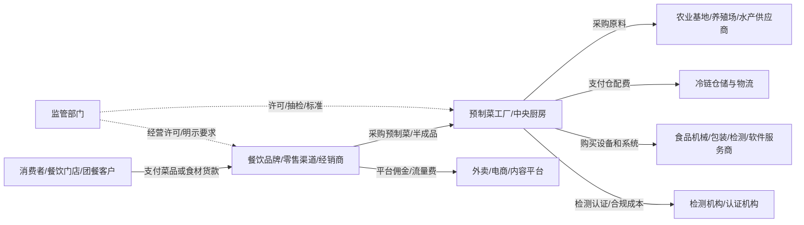

# 预制菜与中央厨房供应链：一盘菜背后的工业化、信任危机与 AI 改造路径

> 为什么今天选这个领域：2026 年预制菜国家标准征求意见把“预制菜到底是什么、餐厅该不该明示、中央厨房算不算预制菜”重新推到台前，而这背后其实是中国餐饮业从手艺活走向工业化、数字化、AI 质控的一次基础设施升级。

## ① 为什么今天认知这个领域

### 一句话概括：这个领域到底是干什么的？

预制菜与中央厨房供应链，本质上是在做一件事：**把原来分散在每一家餐厅后厨、依赖厨师经验和现场人工的“买菜、切配、腌制、烹饪、储存、配送、复热”流程，尽可能前移到标准化工厂和供应链系统里，再通过冷链、门店操作和数字化管理，把一盘菜稳定地送到消费者面前。**

外行看到的是“这菜是不是现炒”；业内真正关心的是四个问题：

1. **原料是否稳定**：今天这批虾、牛肉、土豆、鸡肉，规格、含水率、脂肪率、微生物指标是不是可控？
2. **工艺是否可复制**：同一道菜在上海、郑州、三线城市门店，味道和出餐时间能不能接近？
3. **冷链是否不断链**：从工厂出库到城市仓、门店冷柜、最终复热，中间温度有没有失控？
4. **消费者是否信任**：消费者有没有知情权？是不是拿工业品卖“现炒价”？

所以，预制菜不是单纯“懒人食品”，中央厨房也不是简单“大锅饭”。它是农业、食品工业、冷链物流、连锁餐饮、平台外卖、监管标准、消费者心理共同叠出来的系统。

### 为什么选在今天？

今天选择这个领域，有三个触发因素。

第一，**政策边界正在重新画线**。市场监管总局等六部门在 2024 年 3 月发布《关于加强预制菜食品安全监管 促进产业高质量发展的通知》，首次在国家层面对预制菜定义做了“减法”：预制菜不包括主食、净菜、即食食品和中央厨房制作的菜肴，并提出预制菜不添加防腐剂、推进标准体系建设、推广餐饮环节使用预制菜明示。2026 年 2 月，国务院食安办等部门又就预制菜国家标准、术语分类和餐饮环节自主明示公告征求意见，意味着行业从“营销概念战”进入“标准落地战”。这些信息来自市场监管相关公开报道、福建省政府转发的政策解读，以及国家标准征求意见稿相关报道。

第二，**消费者情绪和产业逻辑出现强烈错位**。在公众讨论里，“预制菜”经常被等同于“便宜料理包、科技与狠活、不新鲜”。但从官方定义看，中央厨房给自有门店配送的半成品并不纳入预制菜；从食品科学看，安全风险的核心不在“预制”二字，而在原料、工艺、冷链和复热；从商业逻辑看，连锁餐饮如果完全靠每个门店厨师现场完成所有工序，很难做到规模化、成本稳定和食品安全追溯。知乎、小红书等平台上大量争论，真正焦点不是技术，而是**消费者觉得自己被隐瞒了**。

第三，**AI 的介入点非常具体，不是泛泛的“颠覆餐饮”**。预制菜和中央厨房天然有数据：原料批次、加工参数、温度曲线、仓储位置、门店销量、复热时长、投诉原因、平台评价。AI 能最先介入的不是“机器人炒菜取代厨师”，而是需求预测、原料分级、视觉质检、温控预警、菜单研发、门店操作合规审查、标签与明示自动生成。这些点比很多纯互联网场景更“脏、更慢、更重”，但也更接近真实商业价值。

### 这件事和大学生/个人开发者/内容创作者有什么关系？

如果你是大学生、个人开发者、内容创作者，预制菜供应链不是离你很远的大工厂生意。它至少给你三类机会。

第一，**做内容壁垒**。多数人只会站队骂“预制菜坏”或“消费者无知”，但真正有价值的内容，是把预制菜、中央厨房、料理包、净菜、速冻调理品、餐饮供应链的边界讲清楚。谁能讲清楚，谁就能在食品安全、消费升级、餐饮创业、AI 产业应用几个赛道建立认知壁垒。

第二，**做 B 端小工具**。很多地方小餐饮、团餐公司、社区食堂并没有成熟系统。个人开发者可以做“菜单成本测算 + 预制程度标注 + 冷链温度异常记录 + 门店操作 SOP 生成”的轻量 SaaS，先从一个县城餐饮老板、一个中央厨房、一个冻品经销商开始验证。

第三，**做产业信息差服务**。预制菜企业最缺的往往不是“再多一个品牌故事”，而是渠道匹配、爆品测试、平台内容、标品化文档、招商资料、合规标签、经销商培训。大学生用 AI 帮他们把这些非核心但耗时的材料做出来，是低门槛切入点。

---

## ② 第一性原理拆解（剥掉行话讲本质）

### 用最朴素的类比解释核心逻辑

可以把餐饮业理解成一个“每天都要考试的手工工厂”。传统小餐馆的模式是：老板每天去市场买菜，厨师凭经验切配调味，顾客来了再炒。好处是灵活、有烟火气；坏处是非常依赖人，今天厨师心情、火候、原料质量、客流波动都会影响结果。

预制菜和中央厨房的逻辑，是把这场每天考试改成“先做标准答案，再让门店按流程交卷”。

比如一道酸菜鱼，传统门店要完成：买鱼、杀鱼、片鱼、腌鱼、炒酸菜、熬汤、调味、煮鱼、装盘。中央厨房/食品工厂会把其中一部分前移：鱼片切好并腌制，酸菜包、汤底包、辣椒油包提前做好，门店只需要解冻、复热、组合、出餐。这样做的价值是：

- 出餐更快：高峰期不需要从零开始；
- 味道更稳定：核心调味不靠每个厨师临场发挥；
- 成本更可控：原料集中采购，损耗集中管理；
- 食安更可追溯：哪批鱼、哪个工厂、哪个班组、哪辆冷链车可以追查；
- 人员更容易培训：门店可以从“厨师组织”变成“操作员组织”。

但代价也很明显：

- 前期投资重：工厂、冷库、设备、质检、研发都要钱；
- 冷链要求高：温度一断，风险就集中爆发；
- 菜品口感有边界：不是所有菜都适合预制；
- 消费者心理敏感：如果卖得像“手工现炒”，但实际是标准化复热，信任会崩。

所以第一性原理很简单：**预制菜不是为了让食物更“高级”，而是用工业化把餐饮的不确定性降低；中央厨房不是为了“偷懒”，而是连锁餐饮对规模、效率、食安和成本的妥协方案。**

### 概念边界：预制菜、中央厨房、料理包、净菜有什么区别？

这一点非常重要，因为很多争议来自概念混用。

根据 2024 年六部门通知以及 2026 年预制菜国家标准征求意见稿相关公开解读，预制菜大致指：以一种或多种食用农产品及其制品为原料，使用或不使用调味料等辅料，**不添加防腐剂**，经工业化预加工制成，配或不配调味料包，**加热或熟制后方可食用的预包装菜肴产品**。它不包括主食、净菜、即食类食品和中央厨房制作的菜肴。

中央厨房则是食品经营企业建立的独立场所和设施设备，集中完成成品或半成品加工制作并配送给本单位连锁门店，供其进一步加工制作后提供给消费者。关键词是“本单位连锁门店”和“进一步加工制作”。

料理包通常是市场俗称，不一定严格等于法规上的预制菜。它可能是常温包、冷冻包、冷藏包，也可能是盖浇饭浇头、汤底、酱料、熟制肉块。很多消费者对“料理包”的负面印象来自低价外卖场景：一个小店没有厨房，只是把工厂包加热倒在米饭上。

净菜是清洗、切配后的食材，比如洗好的生菜、切好的土豆丝、切片牛肉。它并不一定经过熟制或调味。

用大白话说：

- **净菜**：帮你把菜洗好切好；
- **中央厨房半成品**：连锁餐厅自家大厨房帮门店做一部分；
- **预制菜**：食品工厂把菜做成预包装产品，消费者或餐饮端加热/熟制后吃；
- **料理包**：市场俗称，可能是预制菜的一种，也可能只是调味/浇头包。

这就是为什么很多连锁餐饮企业会强调“我们是中央厨房，不是预制菜”。从现行定义上，这句话可能成立；但从消费者体感上，只要不是门店从原料开始现场做，消费者就可能把它统称为“预制”。这就是行业的信任裂缝。

### 产业链全景图：谁生产、谁分销、谁消费、谁监管？

预制菜/中央厨房供应链可以分成八层。

**第一层：农业与养殖原料端。**包括蔬菜基地、畜禽养殖、水产养殖、粮油调味料企业。这里决定了成本大头和食品安全起点。国联水产的案例说明，水产预制菜高度依赖全球海产采购、虾类鱼类价格、上游行情和库存管理；南昌市绿色食品产业链行动方案也把优质农产品基地、绿色直采基地、菜篮子保供基地放在产业链前端。

**第二层：初加工端。**包括屠宰、分割、清洗、去皮、切配、速冻。很多企业利润不高，但它决定标准化程度。比如水产加工中的去头虾、虾仁、鱼片，肉类中的分割牛肉、鸡肉块，都是预制菜的底层积木。

**第三层：深加工/预制菜工厂。**这里完成腌制、滚揉、成型、裹粉、油炸、蒸煮、炒制、调味、杀菌、包装。安井食品、千味央厨、国联水产、海欣食品、亚洲渔港等都在不同品类里扮演类似角色。海欣食品募投材料显示，速冻菜肴制品预测单价可达 2.5 万元/吨，预测毛利率约 25% 左右，高于传统速冻鱼肉制品及肉制品的预测毛利率，说明越接近“菜肴解决方案”，附加值越高。

**第四层：冷链仓储与物流。**包括工厂冷库、城市仓、前置仓、冷藏车、门店冷柜。政策文件中多次提到冷冻冷藏库、终端冷藏设备、冷链物流配送中心补贴，原因很简单：没有冷链，预制菜无法规模化。2026 年国标征求意见稿中还提到需冷冻产品冻结结束时中心温度应不高于 -18℃，这类指标就是行业底线。

**第五层：渠道与经销商。**包括冻品批发市场、餐饮供应链公司、B2B 食材平台、品牌经销商、商超、电商平台、社区团购。国联水产 2024 年董事会工作报告提到，国内流通渠道开发达标经销商约 300 家，新开客户贡献业绩 1.4 亿元；电商渠道中虾仁常年占据京东、淘系类目榜首，预制菜单品增长明显。这说明预制菜不只是工厂生意，更是渠道生意。

**第六层：餐饮/团餐/家庭消费端。**B 端包括连锁餐饮、团餐、学校、医院、企业食堂、酒店宴席、外卖店；C 端包括家庭冰箱、商超、电商、年夜饭礼盒。不同终端关注点不同：连锁餐饮要稳定和成本，团餐要安全和效率，家庭要方便和口味，外卖店要毛利和出餐速度。

**第七层：平台与数据端。**美团、饿了么、抖音、大众点评、京东、天猫、盒马等平台掌握需求侧数据，能够反向影响菜品研发、爆品测试、区域备货和价格策略。国家信息中心《中国餐饮业数字化发展报告（2024）》指出，餐饮业数字化的三个关键内核是线上化、平台化、智能化，销售环节最先数字化，在线外卖成为推动全链条数字化转型的核心动力。

**第八层：监管与标准端。**市场监管、卫健、农业农村、商务、工信等部门共同影响行业。监管重点包括食品生产许可、原料追溯、食品添加剂、标签标识、冷链运输、餐饮明示、监督抽检。2024 年六部门通知、2026 年国标征求意见稿、地方标准和行业标准共同构成了行业约束。

### 金钱流向图：谁付钱、谁收钱，中间商赚多少？

下面用文字画一张“金钱流向图”。数字因品类、渠道、地区差异很大，这里给的是行业逻辑和典型区间，而不是精确报价。

一盘终端售价 38 元的餐饮菜品，如果使用预制/半预制方案，可能的拆分是：

- 原料成本：8-14 元。水产、肉类波动大，是核心成本。
- 工厂加工与包装：3-6 元。包括人工、能耗、调味料、包材、折旧、损耗。
- 冷链与仓储：1-4 元。距离、温区、频次决定成本。
- 经销/供应链加价：2-6 元。冻品经销商、城市仓、餐饮供应链服务商赚的是周转、账期和服务。
- 门店人工、租金、能耗：5-10 元。预制化可以降低厨师成本，但不能消灭房租和服务成本。
- 平台佣金/营销：如果走外卖，可能再吃掉 15%-25% 的交易额。
- 餐饮品牌毛利：看品牌力和客单价，表面毛利高，但扣除租金人工营销后净利未必高。

利润池最厚的环节并不固定，但有几个规律。

第一，**单纯初加工利润薄**。只做切配、分割、速冻，很容易陷入原料价格竞争。国联水产的亏损案例说明，即使是水产龙头，如果上游价格低迷、库存减值、贸易环境不利、产品同质化，也会被周期拖累。

第二，**有品牌、有渠道、有爆品研发能力的深加工更赚钱**。海欣食品募投材料中，速冻菜肴制品预测毛利率高于传统鱼肉制品，说明从“卖原料”升级到“卖菜品解决方案”可以提升附加值。

第三，**连锁餐饮掌握终端定价权，但也背负信任风险**。消费者愿意为品牌、环境、服务、稳定性付费，但如果发现“预制程度”和价格预期不匹配，就会产生强烈反弹。

第四，**冷链与数字系统是隐形收费站**。冷链不一定毛利最高，但它是行业规模化必经之路。地方政策愿意补贴冷库和终端冷藏设备，说明政府也知道这是短板。

第五，**平台掌握需求数据，越来越像“菜单入口”**。国家信息中心报告强调平台对餐饮全链条数字化的串联作用。谁掌握订单数据，谁就能反向定义什么菜值得开发、哪个区域该备货、什么价格能卖动。

---

## ③ 历史演变与关键转折点

### 这个领域是怎么走到今天的？

中国预制菜和中央厨房不是凭空出现的，它是几条线汇合的结果。

**第一阶段：速冻食品和工业化主食打底。**
上世纪末到 2010 年前后，速冻水饺、汤圆、丸子、鱼糜制品、冷冻调理肉制品已经完成消费者教育。这个阶段解决的是“冷冻食品能不能吃、方不方便”的问题。三全、思念、安井等企业让冷冻食品进入家庭和餐饮后厨。

**第二阶段：连锁餐饮扩张推动中央厨房。**
肯德基、麦当劳、必胜客等西式快餐给中国餐饮行业上了一课：餐厅可以不是厨师个人手艺的集合，而是供应链、SOP、设备和品牌的集合。后来中式连锁餐饮也学习中央厨房模式。因为中餐菜品复杂、火候多变、口味区域差异大，标准化难度更高，但只要连锁规模上来，中央厨房几乎不可避免。

**第三阶段：外卖平台把出餐速度变成硬约束。**
外卖兴起后，餐饮不再只服务堂食顾客，还要服务骑手时间、平台评分、配送半径。出餐慢就会被差评，后厨不稳定就会影响复购。很多外卖店和连锁品牌开始使用半成品、调味包、料理包，提高出餐效率。国家信息中心餐饮数字化报告指出，在线外卖通过平台企业构建数字消费、数字供给、数字履约三位一体的新生态，成为餐饮数字化核心动力。

**第四阶段：疫情放大了家庭便利食品和餐饮供应链需求。**
疫情期间，堂食受限、家庭囤货增加、社区团购和生鲜电商发展，预制菜从 B 端悄悄进入 C 端。年夜饭、酸菜鱼、小龙虾、佛跳墙、烤鱼等复杂菜品开始以预包装形式进入家庭场景。许多地方政府也把预制菜写入农业产业化、食品工业、乡村振兴规划。

**第五阶段：舆论争议倒逼标准化。**
当预制菜进入公众话语，负面情绪集中爆发：学校能不能用、餐厅该不该标、是否有防腐剂、价格是否合理。2024 年六部门通知和 2026 年国标征求意见，正是在这个背景下出现。行业从“大家都在做但不愿意说”，走向“必须定义清楚、标清楚、管清楚”。

### 过去10年最大的3次变化及驱动因素

#### 变化一：从“后厨经验”走向“供应链能力”

过去很多餐饮老板的核心资产是厨师、门店位置和口味秘方。今天，连锁餐饮的核心资产越来越变成供应链能力：能不能稳定拿到原料，能不能低成本配送，能不能把菜品拆成标准模块，能不能用数据预测销量。

驱动因素包括：租金人工上涨、厨师短缺、连锁化扩张、外卖高峰压力。国家信息中心报告提到，餐饮业数字化从销售环节向供应、加工、管理环节延伸，智能厨房设备、管理系统、在线外卖调度系统加快应用。这说明餐饮竞争已经从“单店手艺”变成“系统效率”。

#### 变化二：从“B端隐形供给”走向“C端显性消费”

早期预制菜主要在餐饮后厨、团餐、宴席、酒店等 B 端使用，消费者不知道也不关心。疫情后，C 端预制菜礼盒、商超冷柜、电商爆品兴起，消费者开始直接面对“预制菜”三个字。这个变化让行业既获得增量市场，也承受了信任审判。

驱动因素包括：家庭小型化、年轻人做饭时间减少、年夜饭场景、冷链电商、直播带货。但 C 端比 B 端更难做，因为家庭消费者复购依赖口味、健康感、价格和信任，而不是单纯效率。

#### 变化三：从“概念野蛮生长”走向“标准与明示”

2023 年中央一号文件提出培育发展预制菜产业后，地方招商和资本市场一度很热。但随后争议也迅速升温。2024 年六部门通知明确预制菜定义、强调不添加防腐剂、推动明示；2026 年征求意见稿进一步提出原料、加工、贮运、标签、保质期、包装材料等要求。这标志着行业不再只靠营销讲故事，而要接受更细的合规约束。

驱动因素是消费者知情权、食品安全风险、地方产业过热、企业良莠不齐。福建省政府相关解读提到，很多商家担心消费者反感，明示意愿普遍较低；监管方面也存在缺乏快速检测手段、平台难以限制或强制商户打标的问题。这是行业当下最真实的矛盾。

### 目前竞争格局：谁是老大、谁是挑战者、谁在边缘？

预制菜没有一个统一龙头，因为它不是单一行业，而是多个品类和渠道的集合。可以按角色看。

**1. 速冻食品龙头：安井、千味央厨、海欣等。**
它们擅长工厂化、冷冻渠道、餐饮客户和经销网络。优势是规模和渠道，劣势是中式菜肴研发、品牌心智和 C 端信任仍需建立。

**2. 水产预制菜企业：国联水产、亚洲渔港、各地水产加工企业。**
优势是原料和水产加工经验，适合酸菜鱼、烤鱼、虾滑、小龙虾、鱼片等品类。劣势是上游价格波动大、库存风险高、国际贸易和水产消费周期影响明显。国联水产 2024 年收入 34.09 亿元，但归母净利润约 -7.42 亿元，说明“预制菜概念”不能自动带来盈利，供应链和资产质量更重要。

**3. 连锁餐饮自建中央厨房：百胜中国、海底捞系、乡村基、西贝等。**
它们不一定被定义为预制菜企业，但中央厨房能力极强。百胜中国 2024 年营收 113 亿美元，拥有 16,395 家餐厅，供应链覆盖 2,200 多个城市和乡镇，合作 800 多家独立供应商，33 个物流中心，并在食品安全中使用物联网监测和智能物流系统。这类公司真正厉害的是把门店、供应商、物流、数字系统打通。

**4. 地方产业园和农业加工企业。**
南昌行动方案提出打造农产品加工园、绿色直采基地、冷链物流配送中心，并对冷冻冷藏库、终端冷藏设备给予补贴。诏安水产加工和海洋生物制造产业也在推动水产预制菜，铭兴、安邦等企业通过水产品加工切入预制菜。地方政府希望通过预制菜把农产品从“卖原料”升级为“卖食品工业品”。

**5. 平台和零售渠道：美团、盒马、京东、抖音等。**
它们不是生产者，但能决定哪些菜品被看见、哪些区域有需求、哪些价格带跑得通。国联水产提到与盒马业务合作收入同比大幅增长，电商渠道虾仁和预制菜单品增长，就是渠道重塑行业的例子。

**6. 边缘玩家：低价料理包小作坊、无证小店、概念招商项目。**
这些玩家利用信息不透明和低价需求获利，也是行业被污名化的重要来源。真正打击行业信任的往往不是大型规范工厂，而是低质低价、标签不清、冷链不稳的小供给。

---

## ④ AI介入现状与可能性

### AI目前已经能做什么？

AI 在预制菜和中央厨房供应链里，已经不是科幻。它最现实的应用有六类。

#### 1. 需求预测：少备货、少报废、少断货

预制菜最大痛点之一是库存。冷冻产品保质期比生鲜长，但仍有仓储成本和滞销风险；冷藏产品口感更好，但货架期短，报废压力大。AI 可以利用历史订单、天气、节假日、平台活动、区域消费偏好、门店销量、短视频热度预测需求。

国家信息中心报告指出，餐饮业数据要素化是智能化的重要基础，平台企业能整合消费数据和履约数据。麦肯锡关于餐厅未来的观点也提到，AI 会在需求预测、动态定价、菜单设计等环节发挥作用。对预制菜工厂来说，需求预测不是锦上添花，而是直接影响现金流。

#### 2. 原料分级与视觉质检：把“老师傅看一眼”变成机器可记录

水产、肉类、蔬菜原料差异很大。虾的规格、鱼片厚度、肉色、脂肪纹理、异物、破损、冻伤，过去依赖人工分拣。机器视觉 + 深度学习可以识别尺寸、颜色、缺陷、异物，提高一致性。对于标准化菜品来说，原料规格差一点，最终复热口感就会差很多。

学术综述《Enhancing Food Integrity through Artificial Intelligence and Machine Learning》提到，AI/ML 与物联网、大数据、区块链等技术已用于食品安全、质量控制和供应链韧性提升。《The Aspects of Artificial Intelligence in Different Phases of the Food Value and Supply Chain》也总结了 AI 在食品价值链不同阶段的应用和障碍。

#### 3. 冷链温控预警：提前发现“快坏了”

预制菜的安全高度依赖温度。冷链不是“冷过就行”，而是要看温度曲线。AI 可以结合 IoT 温度传感器、车载 GPS、仓库开关门记录、天气、路线拥堵，预测哪一批货存在温度失控风险，提前预警。

食品冷链学术研究长期强调温度管理对微生物安全和品质的重要性。ScienceDirect 上关于 professionally prepared meals 的论文提出“运输过程中解冻”等供应链概念，核心也是在质量、货架期和浪费之间做系统优化。关于 food cold chain 的研究还提出相变储能、被动温控与 AI 辅助设计，用于降低能耗并抑制温度波动。

#### 4. 菜品研发与配方优化：不是让 AI 当厨神，而是缩短试错

中式预制菜研发难点是“复热后还好吃”。有些菜刚炒出来好吃，冷冻再加热就塌了；有些酱汁冷冻后水油分离；有些肉类复热变柴。AI 可以基于配方、工艺参数、感官评价、平台评价、退货投诉，寻找更优组合。

这里 AI 不是替代研发厨师，而是帮研发团队管理实验变量。比如同样是酸菜鱼，鱼片厚度、腌制时间、淀粉比例、汤底油脂、杀菌温度、包装方式都会影响口感。AI 的价值是记录、归因、推荐下一轮实验，而不是凭空创造“神菜”。

#### 5. 门店操作合规审查：摄像头 + SOP 检查

中央厨房把半成品送到门店后，最后一公里仍可能出问题：解冻时间过长、复热不充分、冷柜温度异常、员工手套不规范、先入先出没执行。AI 视觉可以检查门店后厨动作是否符合 SOP，语音/文本系统可以生成每日检查清单，异常自动上报。

这类应用在大型连锁更容易落地，因为门店多、SOP 强、数据多。百胜中国可持续发展报告提到其在食品安全中使用物联网技术、智能物流系统，这代表大型餐饮企业已经把食品安全从“制度墙上挂着”变成“系统实时监测”。

#### 6. 标签、明示与合规文档生成

2026 年预制菜国家标准征求意见稿关注标签标识、食用方式、包装材料、保质期等。餐饮环节自主明示也鼓励企业说明菜品加工方式。AI 可以帮企业把配料表、过敏原、食用方式、预制程度、中央厨房说明、门店话术、培训文档自动化生成，并对照法规进行合规检查。

这对个人开发者很有机会，因为很多中小企业不会花大钱上全套系统，但愿意为“少被投诉、少踩雷、快出招商资料”付费。

### AI理论上还能做什么，但为什么还没做到？

#### 理论可能一：全自动柔性中央厨房

理论上，机器人可以完成切配、投料、炒制、包装、清洗、搬运，AI 根据订单动态调度产线。但现实中，中餐原料形态复杂、油污环境恶劣、柔性抓取困难、设备清洗消毒要求高，导致全自动成本很高。

ScienceDirect 上关于食品供应链具身智能的综述指出，具身 AI 正从农业、初加工、质量检测、包装、冷链物流等环节推进，但食品操作面对真实世界不确定性、卫生约束和柔性物体处理，部署难度远高于标准工业件。

#### 理论可能二：AI 自动判断“这是不是预制菜”

消费者很想要一个工具：拍一下菜单或菜品，就知道是不是预制菜。但现实中，仅凭成品照片很难判断。中央厨房半成品、门店预加工、预包装预制菜、现场复热之间边界复杂，而且法规定义与消费者感受不完全一致。真正可行的是企业主动披露 + 监管抽检 + 平台标注，而不是靠 AI 视觉“鉴定”。

#### 理论可能三：区块链全链路溯源

理论上，每一批原料、加工、温度、运输、门店操作都能上链，消费者扫码看到全流程。但现实里，溯源最大问题不是链，而是数据真实性和录入成本。如果前端数据是假的，上链只会把假数据永久保存。对于中小企业来说，传感器、系统、培训、审计成本也不低。

### 最大的3个阻力

#### 阻力一：数据脏且断裂

预制菜供应链涉及农业基地、加工厂、冷链、经销商、门店、平台。每一环都有自己的系统，很多还停留在 Excel、微信群、纸质单据。AI 要发挥作用，首先要有结构化数据和统一编码：批次、SKU、温区、仓位、客户、订单、投诉。没有数据治理，AI 只能做 PPT。

#### 阻力二：低毛利行业不愿意为“看不见的系统”付费

很多食品企业利润并不厚。国联水产这样的上市公司都可能因为价格低迷、库存减值、消费疲软出现大亏损，更不用说中小工厂。AI 系统如果不能直接证明减少损耗、降低人工、增加订单，很难被采购。

#### 阻力三：信任问题不是技术单独能解决的

消费者不信任预制菜，不只是担心技术，而是担心被隐瞒、被高价售卖、被剥夺选择权。AI 可以提高质控，但不能替代明示、监管和品牌诚信。一个企业如果不愿意告诉消费者真实加工方式，再先进的 AI 质检也无法解决信任赤字。

### 这个领域最怕AI改变什么？最希望AI改变什么？

行业最怕 AI 改变的是**信息不透明带来的利润空间**。过去有些餐厅可以用低价料理包卖“现炒价”，有些供应商可以用模糊标签绕过消费者感知，有些经销商可以靠信息差吃高价。AI + 平台 + 标准化明示会让这种灰色空间变小。

行业最希望 AI 改变的是**损耗、波动和食品安全事故**。食品企业最怕报废、召回、投诉、抽检不合格。一旦 AI 能降低库存报废、温控异常、异物投诉、门店操作失误，它就不是概念，而是保险。

---

## ⑤ 商业案例深度拆解

### 案例1：百胜中国——中央厨房与数字供应链的“隐形巨人”

#### 商业模式、收入规模、关键数据

百胜中国是中国最大的餐饮公司之一，旗下有肯德基、必胜客等品牌。根据 SEC 10-K 和百胜中国公开年报，2024 年公司营收约 113 亿美元，年末拥有 16,395 家餐厅，是中国 2024 年系统销售额最大的餐饮公司。其 2024 年可持续发展报告披露，公司运营覆盖中国 2,200 多个城市和乡镇，服务超过 20 亿人次顾客，拥有 35 万名以上员工，合作 800 多家独立供应商及其上游网络，并建立 33 个物流中心和基础设施。

百胜中国的核心不是“某一道菜特别难复制”，而是把供应商、物流中心、门店、数字化会员、外卖履约、食品安全系统整合成一个可扩张网络。

#### 为什么成功？

第一，**品类设计适合标准化**。肯德基、必胜客的很多产品天然适合中央厨房和标准设备：炸鸡、汉堡、披萨、薯条、蛋挞、饮品。这些产品的关键在原料规格、腌制、面团、设备温度、时间控制，而不是厨师临场发挥。

第二，**供应链投入足够重**。33 个物流中心不是轻资产故事，而是重资产护城河。冷链、仓储、配送频次、食品安全追溯共同支撑了上万家门店。

第三，**数字化和会员系统反向驱动供应链**。大规模订单数据让百胜能预测需求、设计促销、优化备货。国家信息中心报告所说的“平台化、智能化”在这种企业里已经部分实现。

第四，**消费者对快餐标准化有心理预期**。消费者去肯德基不会期待后厨大师傅现杀现炒，所以中央厨房和工业化不会引发强烈背叛感。反而消费者希望每家店味道一致。

#### 踩过什么坑？

百胜体系历史上也经历过供应商食品安全事件、舆论风波和监管压力。大型连锁的风险在于：一旦供应链某环节出问题，影响不是单店，而是全国品牌。规模越大，越需要系统化食安和供应商审计。

#### 对个人的启示

个人不要只学“肯德基菜单”，要学它背后的思维：**先把产品设计成可复制模块，再用数据和流程保证稳定交付。**如果你做内容，可以拆解“为什么西式快餐工业化被接受，而中餐预制化被骂”；如果你做工具，可以服务中小连锁，把菜单、SKU、门店 SOP、温控记录、投诉反馈结构化。

### 案例2：国联水产——水产预制菜的机会与周期陷阱

#### 商业模式、收入规模、关键数据

国联水产是中国水产加工和海洋食品企业，聚焦水产食品和预制菜。其 2024 年董事会工作报告显示，公司 2024 年实现营业总收入 34.09 亿元，同比减少 26.16%；归属于上市公司股东净利润约 -7.42 亿元，亏损扩大。中国市场收入 23.37 亿元，占总营收 68.54%；国外市场收入 10.72 亿元，占 31.46%。公司提到水产行业受宏观经济、消费信心不足、南美白对虾行情低迷、产品销售价格下跌、资产减值等影响。

同时，公司也在预制菜和渠道上有亮点：国际渠道中预制菜进入欧洲、日本、韩国市场，虾滑出口额同比增幅超 90%；电商渠道中黑鱼片产品同比增长 600%；餐饮重客渠道为大型连锁餐饮提供新品研发、菜品创意、稳定供应、食品安全保障等解决方案。

#### 为什么有机会？

第一，**水产是预制菜天然大品类**。鱼片、虾仁、虾滑、烤鱼、小龙虾、牛蛙、酸菜鱼都适合标准化。家庭消费者处理水产麻烦、餐饮门店处理水产损耗高，所以预制化价值明显。

第二，**全球供应链与加工能力有门槛**。水产原料涉及全球采购、冷冻运输、检验检疫、规格分级、库存管理，不是普通小厂能轻易做到。

第三，**餐饮客户需要解决方案而不是原料**。国联水产提到为餐饮客户开发 30 余款新产品，说明 B 端客户要的是“能直接上菜单的菜品方案”。

#### 为什么亏损？

第一，**上游价格周期会吞掉加工利润**。南美白对虾等水产品价格低迷，库存跌价，销售价格下行，企业即使加工能力强也可能亏。

第二，**重资产和库存压力大**。水产冷链和库存占用资金，一旦需求不及预期或价格下跌，会形成资产减值。

第三，**预制菜不是救命万能药**。很多投资者以为“预制菜概念”=高增长高毛利，但国联水产案例说明，如果基础品类周期、渠道、库存、资产负债没有处理好，预制菜只能提供部分结构改善，不能消除商业基本面。

#### 对个人的启示

不要看到某个行业热就直接冲。预制菜真正的机会不在“喊口号”，而在发现具体品类的痛点：哪种食材家庭处理麻烦？哪种菜餐饮门店损耗高？哪种产品复热后口感仍好？哪种渠道愿意付钱？个人可以从“水产预制菜单品数据库”“餐饮客户新品资料包”“小红书家庭复热测评”切入，而不是一上来做品牌。

### 案例3：海欣食品募投材料——速冻菜肴制品为什么比传统鱼肉制品更有想象力

海欣食品的融资问询回复材料提供了一个很好的财务窗口。其速冻菜肴制品报告期销售单价约 1.99-2.61 万元/吨，募投项目预测单价 2.5 万元/吨；项目达产后速冻菜肴制品预测毛利率约 25.73%-25.84%，高于速冻鱼肉制品及肉制品约 19.12%-19.23% 的预测毛利率。

这说明一个关键事实：**越接近“菜肴解决方案”，越有机会拿到更高附加值；越只是卖标准原料，越容易陷入价格战。**

但材料也提到，速冻菜肴制品早期探索阶段毛利波动很大，2021 年甚至因规模小、外购模式、成本控制弱出现负毛利。这提醒我们：新品类不是天然赚钱，规模、工艺、供应链和渠道都要跑通。

---

## ⑥ 认知误区与反直觉事实

### 最常见的3个外行误解

#### 误解一：预制菜一定加了很多防腐剂

官方文件明确提出预制菜不添加防腐剂。国家食品安全风险评估中心专家在公开解读中说明，预制菜通常通过冷冻、冷藏、高温杀菌、气调包装等物理手段或工艺控制保障安全，不需要靠防腐剂延长不必要的长保质期。当然，不添加防腐剂不等于没有食品添加剂，也不等于一定健康，调味、增稠、护色等仍需要按标准使用。

#### 误解二：中央厨房就是预制菜

按照现行政策边界，中央厨房制作并配送给自有连锁门店、供进一步加工制作的菜肴，不纳入预制菜范围。但消费者感受上，只要不是门店从零开始现做，就容易被归入“预制”。所以行业要面对两个定义：法规定义和消费者定义。只用法规定义回怼消费者，解决不了信任问题。

#### 误解三：预制菜就是低端料理包

低价料理包确实存在，也确实拉低了行业形象。但预制菜还包括高品质水产、酒店宴席菜、年夜饭大菜、连锁餐饮半成品、团餐标准化菜品。问题不在“预制”本身，而在原料、工艺、冷链、标签、价格是否匹配。

### 3个连从业者都可能搞错的反直觉事实

#### 反直觉事实一：越想做 C 端品牌，越不能只讲“方便”

B 端买预制菜主要买效率和成本，C 端买的是“我愿意把它端上桌”。家庭消费者会在意健康、体面、仪式感、配料表、复热失败率。只讲三分钟出餐，很容易被归类为低端懒人食品。C 端品牌要卖的是“降低做大菜门槛”，不是“你不用做饭了”。

#### 反直觉事实二：预制菜最难的不是做熟，而是复热后还像菜

很多菜在工厂刚做完很好吃，但冷冻、运输、解冻、微波/蒸煮/炒锅复热后，口感会明显下降。淀粉老化、肉类失水、蔬菜软烂、汤汁分层、香气挥发都是难点。真正的研发能力在“经历冷链和复热后仍能接受”。

#### 反直觉事实三：标准越严格，短期可能淘汰小厂，长期反而利好行业

很多企业害怕国标和明示，因为担心成本上升、消费者反感。但没有标准，劣币驱逐良币，规范企业反而吃亏。统一定义、标签、冷链、抽检和明示，会让行业从“谁敢不说真话谁赚钱”变成“谁做得透明谁有品牌”。

### 这个领域「不能说出口」的真相

第一个真相：**很多餐饮品牌不是不能明示，而是不敢让消费者把价格和预制程度放在一起比较。**消费者不一定反对预制，但会反对“用预制降低成本，却按现炒情绪价值收费”。

第二个真相：**预制菜对厨师岗位的影响不是消灭，而是分层。**普通门店厨师会被操作员替代一部分，高级研发厨师、供应链厨师、菜品工程师反而更值钱。

第三个真相：**食品安全事故最可能发生在边界地带**：小工厂、外协加工、经销商仓库、门店冷柜、临期库存、复热操作，而不是企业宣传片里最干净的中央工厂。

### 目前AI还不能替代的核心环节

1. **最终风味判断**：AI 可以分析数据，但“好不好吃、像不像家常菜、会不会腻”仍需要人类感官和文化经验。
2. **供应商信任与审计**：AI 可以监测异常，但现场审厂、谈判、长期关系、道德风险判断仍离不开人。
3. **消费者信任修复**：明示、品牌承诺、危机公关、价值观表达，不是模型自动生成就能解决。
4. **复杂中餐研发**：火候、锅气、复热口感、地方口味迁移，需要厨师、食品工程师、消费者测试共同完成。

---

## ⑦ 个人行动地图（如果我是你，我会怎么做）

### 今天可以做的3件事

#### 1. 打开国家市场监管总局/政府网站，读预制菜政策原文和解读

建议搜索并阅读：

- 《关于加强预制菜食品安全监管 促进产业高质量发展的通知》（国市监食生发〔2024〕27号）
- 2026 年《食品安全国家标准 预制菜》征求意见相关新闻解读
- 《预制菜术语和分类》国家标准征求意见稿相关报道

重点不是背术语，而是搞清楚：预制菜不包括什么、为什么强调不添加防腐剂、中央厨房为什么被排除、餐饮明示为什么是“鼓励自主”而不是强制。

#### 2. 下载并阅读国家信息中心《中国餐饮业数字化发展报告（2024）》

网址可从国家信息中心官网或搜索“中国餐饮业数字化发展报告 2024 PDF”获取。重点看三章：餐饮数字化三阶段、平台作用、数字供应/加工/管理/销售指标。读完你会明白，预制菜争议只是表层，底层是餐饮全链条数字化。

#### 3. 去京东/盒马/美团/抖音观察10个预制菜 SKU

具体做法：

- 搜“酸菜鱼 预制菜”“烤鱼 半成品”“虾滑”“佛跳墙”“小龙虾”；
- 记录价格、克重、配料表、保质期、复热方式、差评原因；
- 看评论里消费者抱怨的是口味、分量、腥味、复热麻烦，还是觉得不值。

这比看 10 篇空泛研报更接近真实需求。

### 本周可以验证的假设

#### 假设1：消费者反对的不是预制，而是不透明和不值

验证方法：做一个小红书/朋友圈投票，设置四个选项：

1. 餐厅用预制菜但明确标注，价格便宜 20%，能接受；
2. 餐厅用中央厨房半成品但不标注，不能接受；
3. 家里买高品质预制年夜饭，能接受；
4. 只要不是现炒都不能接受。

收集 50 个回答，你会发现大家并不是简单反预制，而是在意场景、价格和知情权。

#### 假设2：中小餐饮老板愿意为“菜品成本测算 + 半成品供应商匹配”付费

验证方法：找 5 家本地餐饮店、外卖店、学校附近快餐店，问三个问题：

- 你最头疼哪道菜备货和损耗？
- 如果有标准半成品，能接受的采购价是多少？
- 你是否需要一个表格/工具帮你算每道菜毛利和出餐时间？

不要先写代码，先问真实老板。

#### 假设3：预制菜内容可以做成“反焦虑科普”账号

验证方法：发布 3 条内容：

- 《中央厨房不等于预制菜，但消费者为什么还是生气？》
- 《预制菜最该担心的不是防腐剂，而是冷链断链》
- 《一份酸菜鱼从工厂到餐桌，到底经过了什么？》

看收藏率和评论问题。如果用户愿意问问题，说明认知缺口存在。

### 本月可以启动的项目

#### 项目1：预制菜透明标签数据库

做一个 Notion/飞书表格或网页，收录 100 个预制菜 SKU：品牌、品类、价格、克重、配料表、保质期、温区、复热方式、差评关键词、是否适合家庭。用 AI 自动总结“高频投诉”。后续可以做成内容号、选品工具或消费者指南。

#### 项目2：餐饮门店半成品使用明示模板

为小餐饮做一套模板：菜单标注方式、点餐小程序文案、员工回答话术、供应链说明、后厨 SOP。收费可以很低，比如 199-999 元一套。核心卖点是“降低被投诉风险，提升信任”。

#### 项目3：冷链温度异常记录小工具

不用一开始接硬件，可以先做“人工录入 + 拍照 + AI 总结”的轻工具。门店每天上传冷柜温度、到货照片、批次标签，AI 生成异常提醒和检查报告。目标客户是小连锁、团餐公司、社区食堂。

#### 项目4：地方预制菜企业 AI 资料包服务

很多地方食品企业不会做招商 PPT、产品手册、小红书内容、抖音脚本、经销商培训。你可以用 AI 帮他们整理：企业故事、产品卖点、合规依据、渠道话术、短视频脚本。先从本地农业产业园、冻品批发市场、食品展会找客户。

---

## ⑧ 延伸阅读与资源库

### 必读报告/论文

1. **市场监管总局等六部门：《关于加强预制菜食品安全监管 促进产业高质量发展的通知》（2024）**  
   这是理解中国预制菜政策边界的起点，重点看定义、范围、不添加防腐剂、标准体系和餐饮明示。

2. **国家信息中心：《中国餐饮业数字化发展报告（2024）》**  
   把餐饮数字化拆成线上化、平台化、智能化，解释为什么外卖平台和数据要素会改变餐饮供应链。

3. **预制菜国家标准征求意见稿相关解读（2026）**  
   重点看原料、加工、冷链、保质期、包装、标签、食用方式，以及中央厨房和预制菜的边界。

4. **ScienceDirect: Improving the supply chain and food quality of professionally prepared meals**  
   讨论专业预制餐供应链如何在质量、效率、可持续之间平衡，提出模块化 meal elements 和运输中解冻等思路。

5. **MDPI: Enhancing Food Integrity through Artificial Intelligence and Machine Learning: A Comprehensive Review**  
   总结 AI/ML 在食品安全、质量控制、供应链韧性中的应用。

6. **MDPI: The Aspects of Artificial Intelligence in Different Phases of the Food Value and Supply Chain**  
   适合理解 AI 在食品价值链各阶段的应用与障碍。

7. **Yum China 2024 Annual Report / Sustainability Report**  
   看大型连锁餐饮如何搭建供应链、物流中心、物联网食安和数字化体系。

8. **国联水产 2024 年董事会工作报告/年报摘要**  
   看水产预制菜企业在真实市场周期里如何增长、亏损、调整渠道和聚焦主业。

9. **海欣食品向特定对象发行股票审核问询函回复**  
   里面有速冻菜肴制品单价、毛利率、募投项目测算，是理解预制菜财务模型的好材料。

### 值得关注的人/账号/社群

- 食品安全与标准领域：国家市场监管总局、国家食品安全风险评估中心、中国标准化研究院相关公开账号。
- 餐饮供应链领域：中国连锁经营协会、餐饮老板内参、红餐网、窄门餐眼。
- 食品工业与预制菜展会：中国食材电商节、良之隆、各地预制菜产业大会。
- 公司案例：百胜中国、安井食品、千味央厨、国联水产、盒马、锅圈等。

### 有用的数据工具/数据库

- 巨潮资讯网：查 A 股食品企业年报、问询函、募投材料。
- SEC EDGAR：查百胜中国、Sysco 等海外上市公司文件。
- 国家统计局：查餐饮收入、食品工业、居民消费数据。
- 国家标准全文公开系统：查食品、冷链、包装、标签相关标准。
- 京东/天猫/抖音/小红书：观察真实消费者评价和预制菜 SKU。
- 美团/大众点评：观察餐饮菜单、预制争议、消费者对“现做”的敏感点。

---

## 自检清单

- [x] 报告已围绕一个新领域展开：预制菜与中央厨房供应链。
- [x] 与近7天已有报告不重复：近7天已有冷链物流、AI SEO、快递驿站、高考志愿等，未发现同主题。
- [x] 覆盖学术/官方一手：六部门通知、国标征求意见、国家信息中心报告、上市公司年报/公告、学术论文。
- [x] 覆盖行业数据与商业案例：百胜中国、国联水产、海欣食品，并引用南昌地方产业政策。
- [x] 有产业链与金钱流向图。
- [x] 有 AI 结合路径：需求预测、质检、温控、研发、门店合规、标签明示。
- [x] 有误区、反直觉事实和 AI 不能替代的环节。
- [x] 个人行动建议具体到网站、报告、工具和可验证项目。
- [ ] 需要同步到飞书知识库「无限学习」文件夹。

## 💡 今日金句

**预制菜真正要预制的不是一盘菜，而是信任：菜可以提前做，但知情权不能延后上桌。**

## 📌 跨领域联想

预制菜供应链的逻辑，可以迁移到很多领域：

1. **教育内容工业化**：名师经验被拆成标准课件、题库、答疑 SOP，再由本地老师交付，类似中央厨房 + 门店复热。
2. **医疗服务标准化**：检查、分诊、术后随访可以标准化，但核心诊断和信任关系不能完全预制。
3. **短视频内容工厂**：爆款脚本、素材、剪辑模板像预制菜，账号人格和真实体验像门店现炒。
4. **AI Agent 服务**：后台工作流可以标准化，前台对用户的解释和信任建立必须透明。
5. **制造业柔性供应链**：原料模块化、工艺参数化、订单预测、质量追溯，与预制菜高度相似。

如果用一句话迁移：**凡是“用户想要个性化体验，但企业必须规模化交付”的行业，都会遇到预制菜式矛盾：效率越高，越要解释清楚你到底替用户省了什么、又拿走了什么。**
