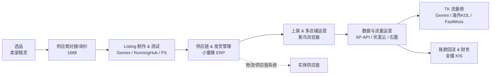

# 跨境电商（亚马逊卖家为例）新人工具 & 流程手册

> **目的**：让新人在最短时间内搞懂「我们做亚马逊到底走什么流程、用哪些工具、每个工具关键是干什么」。
> **怎么读**：先顺着「零、一张图」走一遍主线，再往下看每一阶段用到的工具。每个工具固定三段——
> - **核心关键作用**：它在这个环节到底是干什么的；
> - **底层逻辑（冰山）**：表面之下的真实机制，为什么离不开它；
> - **坑与反常识（正反竞奇）**：刚需之外的注意点和反直觉真相。
>
> 只讲干货，不介绍工具背景。最终目标只有一个：**理解电商的工作流程**。

---

## 零、一张图看懂全流程

**一句话串起来**：选品定方向 → 询价锁成本 → 做图做文案测试 → ERP 管货 → 多店上架防关联 → 数据驱动运营 → TK 引流 → 回款记账。下面按这条线逐个讲。

---

## 一、选品阶段

> **顺序提醒**：选品 → 询价 → 定品。很多人把询价放到后面，但正确做法是**定品之前 / 同时就询价**——算毛利时需要供应商报价，否则毛利是「空算」。

### 1.1 卖家精灵（SellerSprite）—— 选品数据望远镜
- **核心关键作用**：用平台大数据把任意类目的销量、竞品、关键词、市场容量、竞争强度拉到眼前，让「这个品值不值得做」从拍脑袋变成可量化决策。
- **底层逻辑（冰山）**：本质是「把亚马逊不公开的数据反向估算出来」——销量靠估算模型、竞品靠 ASIN 反查、关键词靠抓取，是算法推断不是官方账本，要留安全边际。它和优麦云同属云雅科技，是同一套数据底座的两层（选品层 vs 运营层）。真正值钱的是「快速筛掉 90% 不能做的品」——开发岗一个月出 20–30 个品，靠的就是这种否决速度。
- **坑与反常识**：工具再强也救不了「不敢下单」的人。很多团队买会员只用来验证自己早想做的品（确认偏误），反而更贵。数据是用来**杀死错误直觉**的，不是用来**佐证既有执念**的。

### 1.2 1688 —— 供应链起点，定品前先询价
- **核心关键作用**：中国最密集产业带的货源批发市场，用来找工厂、比价、谈 MOQ、贴标、一件代发。定品前先来这询价，因为毛利算的是「含供应商报价」的毛利。
- **底层逻辑（冰山）**：本质是「中国制造业过剩产能的入口」，你买的是产业带的边际成本。一件代发让新手零库存测品，但代价是利润被供应商再切一层、品控失控。询价不是「问个价」，是「用 MOQ、交期、贴标能力反推生意模型是否成立」。
- **坑与反常识**：过度比价会陷入「劣币驱逐良币」——最低价常伴最差品控和最慢交期，新手容易为省 1 块钱丢掉一个差评炸弹。

### 1.3 头程 / 尾程 FBA —— 成本命脉
- **核心关键作用**：算清「这个品到底赚不赚」的两条命脉成本。头程＝货从国内工厂运到亚马逊 FBA 仓（海运/空运/快递）；尾程＝FBA 把货送到买家手里（按件扣）。
- **底层逻辑（冰山）**：头程有 9 大成本类别（起运地操作、海/空运费、目的港清关、关税、换柜、尾派等），不是「一个运费」。尾程费率随尺寸/重量阶梯上涨，大件货尾程能吃掉大半毛利。选品阶段必须把头程+尾程+产品成本+平台佣金全塞进去，漏一项就是「账面盈利实际亏」。
- **坑与反常识**：很多人把头程当固定成本，但海运/空运价差可达数倍，旺季仓位紧张时「能不能发出去」比「多花多少钱」更要命——供应链韧性比单价更重要。

---

## 二、Listing 制作 & 测试迭代

> 上架一个 AMZ 链接，至少需要三样：**五点 Listing + 商品链接 + 商品图**。这一阶段把「品」变成「能卖的页面」。

### 2.1 五点 Listing（Bullet Points）—— 搜索 + 转化双开关
- **核心关键作用**：商品详情页那 5 条卖点文案，直接决定买家点不点、买不买，是「搜索权重 + 转化率」的双重开关。
- **底层逻辑（冰山）**：五点不是装饰，是亚马逊算法理解「这个品是什么、匹配什么词」的核心语料，埋词质量直接影响自然搜索排名；它还是「对抗差评」的第一道防线——卖点讲清楚，退货率和客诉才降得下来。
- **坑与反常识**：堆关键词（keyword stuffing）会被降权、被买家嫌弃。五点要「人话 + 埋词」，不是词表。

### 2.2 Gemini —— 文案 / 视频 AI 初稿引擎
- **核心关键作用**：写改五点 / 标题 / A+ 文案、快速生短视频素材。把「人写 2 小时」压到「AI 出初稿 2 分钟 + 人改 10 分钟」。
- **底层逻辑（冰山）**：价值不在「替代人」，在「把人的注意力从 0→1 挪到 70→100」——初稿交给模型，人只做判断和本土化。多模态能力（文/图/视频一体）让它成了 TK 侧出片主力。
- **坑与反常识**：直接照搬 AI 文案会有「AI 味」和事实错误（尤其尺寸/认证/合规话术），跨境写错合规表述（如医疗声称）会被下架。**AI 出稿必须人审合规**。

### 2.3 RunningHub —— 商品图 / 视频 AI 流水线工厂
- **核心关键作用**：基于云端 ComfyUI，零代码拖拽工作流，批量生成主图、场景图、尺寸图、视频，不依赖本地显卡。
- **底层逻辑（冰山）**：本质是「把复杂的 AI 模型推理封装成可复用节点流」，一次调好工作流，后续几千张图同参数批量出。把「拍一套图几千块」变成「跑一次工作流几块钱」，且能快速换模特/场景做 A/B。
- **坑与反常识**：生成图常有「手、字、结构」翻车，平台对 AI 图合规尺度在收紧；它出的是「素材」不是「成品」，修图环节省不掉，后面还要接 PS。

### 2.4 Photoshop —— AI 出图过审精修最后一关
- **核心关键作用**：白底、去水印、尺寸达标、修穿帮的质检 + 合规 + 精修。
- **底层逻辑（冰山）**：亚马逊对主图有硬规矩（纯白底、占比 85%、无文字），过不了审核图就上不去。PS 处理的是 AI 图的「确定性错误」——AI 负责创意，PS 负责不犯错。
- **坑与反常识**：把 PS 当万能补丁会拖慢节奏；最佳实践是「工作流设计时就按过审标准出图」，减少 PS 返工。

---

## 三、供应链 & 发货管理：小蜜蜂 ERP

- **核心关键作用**：采购、库存、发货、订单、利润核算的「统一管理系统」，是业务数据的中央账本，让多平台多店铺的货和钱有迹可循。
- **底层逻辑（冰山）**：隐形价值是「把人脑记不住的流水变成可查询的历史」，没有它做 3 个店以上就会乱。关键边界：**物流和供应链的「系统开发」部分不在 ERP 内**——它管执行数据，不是底层物流网络的搭建。
- **坑与反常识**：ERP 越全越容易「被系统绑架」，流程为系统让步而非为效率让步；且 ERP 数据再准也救不了「选品错了」的生意（garbage in, garbage out）。新人别神化 ERP，它管执行不管内核。

---

## 四、上架后：多店铺运营 & 防关联

### 4.1 紫鸟浏览器 —— 多店防关联独立环境
- **核心关键作用**：给每个亚马逊店铺开隔离环境（独立指纹 + 独立 IP），让平台以为是不同的卖家在不同设备操作，避免关联封号。
- **底层逻辑（冰山）**：原理＝伪造/隔离浏览器指纹（时区、UA、分辨率、字体、canvas、WebRTC、MAC 等）+ 独享干净 IP，每个环境 Cookie/缓存完全隔离。紫鸟系（紫鸟浏览器 + LinkFox）同属紫讯科技，形成「防关联环境 + AI 运营」一体生态。它解决的是平台红线：亚马逊不允许同人开多店，关联即封。
- **坑与反常识**：防关联不是 100%——操作习惯、支付卡、手机号、上网行为仍可能暴露关联。工具降低风险，但「同一套运营 SOP 全店复制」反而会成为平台识别特征——**越像，越危险**。

### 4.2 运营要看的数据
- 广告投流（PPC）、销售数据、竞品数据。
- AMZ 自带数据 API 已经很完善：**SP-API**（销售/库存/订单）、**Amazon Ads API**（广告）、**Creators API**（达人/联盟）。
- 但「批量」操作复杂度高 → **AI 定时触发 + 自动反馈**这个场景很有意思（定时拉数据、异常报警、生成日报），把人从重复轮询里解放。
- **坑与反常识**：官方接口准且稳，但接入/维护成本高（开发者账号、OAuth、限流、API 版本弃用）。小团队不该一上来自建，先吃第三方工具的现成集成（见下），规模化后再考虑直连。

---

## 五、数据与流量运营（工具箱）

### 5.1 优麦云（SellerSpace）—— 店铺 / 广告精细化看板
- **核心关键作用**：首页看板统跟踪销售/订单/广告/利润/支出，支持广告定时策略、利润核算、AMC 集成，网页+插件+小程序多端。
- **底层逻辑（冰山）**：和卖家精灵同属云雅科技，是「选品数据 → 运营数据」的闭环承接，本质是「把难用的 SP-API 翻译成开箱即用的官方数据视图」。广告定时策略 + 利润核算是它相对纯看板的差异化（从「看」到「管」）。
- **坑与反常识**：它再细也是「滞后数据」（T+2 左右），复盘可以，实时抄底竞品不一定够；且多一层 SaaS 订阅＝成本。

### 5.2 SIF 数据 —— 流量结构透视镜
- **核心关键作用**：看穿亚马逊「流量从哪来」——覆盖自然搜索、PPC 广告、Deal、搜索推荐、关联流量，做流量结构反查和竞品拓词。
- **底层逻辑（冰山）**：选品/运营最大盲区是「只知道竞品卖得好，不知道流量靠什么词、什么广告结构进来」。SIF 拓词模式（竞品/词根/品类/手动）本质是「用竞品的流量结构反推你的词表」。
- **坑与反常识**：反查的是「历史流量结构」，竞品今天推的词明天可能弃了；全信会陷入「追随者陷阱」——永远慢半拍。

### 5.3 LinkFox —— 一站式 AI 运营 agent
- **核心关键作用**：想做「一个 agent 管完店铺运营」——AI 选品洞察、5 分钟生成高转化 Listing（文案+作图）、竞品拆解、广告智能优化，7×24 自动运营，号称降本 50%。
- **底层逻辑（冰山）**：同属紫讯科技（紫鸟系），是「防关联浏览器 + AI 运营」生态的 AI 层。价格 299–1699/月，按积分/额度消耗。
- **坑与反常识**：**积分消耗太重，用起来比预期贵**；agent 自动操作有「误操作/违规风险」（自动改价、自动投广告一旦逻辑错，亏的是真金白银）。它是「放大器」，能力越强出错代价越大——**新手慎用全自动**。

### 5.4 石墨文档 —— 需求 / 流程协作白板
- **核心关键作用**：公司内部的协作工具，需求提报、流程确认、SOP 沉淀都走它。
- **底层逻辑（冰山）**：跨境团队最痛的不是工具多，是「信息散在微信/口头/表格」。石墨把流程固化下来，新人才接得住，本质是「组织记忆的容器」。
- **坑与反常识**：文档一旦泛滥（人人建不归档）反而成信息垃圾场。关键是「少而精 + 有人维护」，不是建得多。

### 5.5 Google Trends —— 免费趋势晴雨表
- **核心关键作用**：看搜索趋势，辅助选品和关键词，判断一个词是上升还是衰退。
- **底层逻辑（冰山）**：免费、全局（非亚马逊站内）的需求信号，适合选品早期判断大趋势方向。但它是「相对热度」不是「绝对销量」，只能当方向参考。
- **坑与反常识**：趋势热 ≠ 能赚（红海趋势一样卷）；且搜索热度到跨境可售性之间隔着合规、物流、专利三座山。

### 5.6 AMZ123 —— 规则 / 工具 / 资讯导航入口
- **核心关键作用**：亚马逊卖家的网址导航 + 资讯 + 规则集散站，每天打开它一站式进后台、看政策更新、找工具、读干货。
- **底层逻辑（冰山）**：价值是「降低信息获取摩擦」——平台规则、类目更新、封号预警都在这集中，是卖家的「每日必刷」。
- **坑与反常识**：资讯过载，很多「干货」是软文/引流；新人容易被「暴富教程」带偏。把它当导航和警报，别当教科书。

---

## 六、流量侧：TikTok（TK）运营

### 6.1 Gemini 生视频（见第二节 2.2）
TK 侧短视频素材也用 Gemini 快速出，逻辑同「内容生成引擎」。

### 6.2 海外 KOL 建联（WotoHub / 达人广场）
- **核心关键作用**：TK 流量侧「找对人带货」的引擎。TikTok Shop 上至少 60% 销量来自达人合作，建联是撬动流量的杠杆。
- **底层逻辑（冰山）**：主流做法＝用 WotoHub（6000 万红人库）/ FastMoss 旗下 MossCreator（3 亿达人）/ TikTok 官方「达人广场」筛选+批量私信建联。痛点：邀约回复率常 <15%，样品寄出石沉大海——建联难在「精准匹配」而非「广撒网」。
- **坑与反常识**：达人合作「不可控、难规模化、账期乱」；依赖单一达人＝把命交出去。成熟打法是「金字塔结构」（少量头部 + 大量腰部 + 素人铺量），而非赌一个爆单达人。

### 6.3 FastMoss —— TK 一站式数据眼 + 达人建联入口
- **核心关键作用**：TikTok 电商一站式数据分析——爆品挖掘、达人建联、直播监测、广告素材解析、竞品店铺跟踪，多国市场同步。
- **底层逻辑（冰山）**：覆盖 达人/商品/视频/广告/直播/商家 六维，是 TK 侧的「卖家精灵 + 优麦云」合体。旗下 MossCreator 专做达人建联（批量私信、定向计划、邮件），和 6.2 打通。选品逻辑：用商品榜/直播榜/达人榜找对标 → 反查竞品小店 → 指导自己选品和达人投放。
- **坑与反常识**：数据强 ≠ 决策强，TK 爆品生命周期极短（周级别），跟品慢一步就接盘；它偏「站内已发生的」，预测下一波要靠人的嗅觉。

---

## 七、账款回流 & 财务：金蝶 KIS

- **核心关键作用**：回款、对账、记账的「财务系统」——账款回流到财务侧走它管理，覆盖财务 + 进销存。
- **底层逻辑（冰山）**：贵司用的是偏老版本（KIS 专业版 V16 这类），是「业财税」闭环的末端：前端卖货，后端金蝶记账。跨境财务特殊性：多平台、多币种、VAT/关税、回款周期长，金蝶把「流水」变成「可报税可审计的账」。
- **坑与反常识**：老版本功能僵化、和前端运营系统割裂（数据要人工搬），形成「信息孤岛」；财务数据和业务数据对不上，是很多跨境公司的隐形失血点。未来该考虑业财一体化打通。

---

## 八、实体供应链端（简略）

偏实体链路（工厂生产、质检、入仓物流）我这边不熟，新人重点先搞懂前面 1–7 的工具流即可，实体部分由对应同事对接。

---

## 附：工具速查表（新人背这个）

| 阶段 | 工具 | 一句话核心作用 |
|------|------|------|
| 选品 | 卖家精灵 | 选品数据望远镜，量化「做不做」 |
| 供应商 | 1688 | 供应链起点，定品前先询价 |
| 成本 | 头程/尾程 FBA | 物流成本命脉，毛利算不清就别做 |
| Listing | 五点 Bullet Points | 搜索+转化双开关文案 |
| 文案 | Gemini | 文案/视频 AI 初稿引擎（须人审合规） |
| 图片 | RunningHub | 商品图/视频 AI 流水线工厂 |
| 修图 | Photoshop | AI 出图过审精修最后一关 |
| 供应链 | 小蜜蜂 ERP | 采购/库存/发货/利润中央账本 |
| 多店 | 紫鸟浏览器 | 多店防关联独立环境 |
| 数据 | SP-API / Ads / Creators | 官方数据管道，批量难→AI 定时触发 |
| 看板 | 优麦云 | 店铺/广告精细化看板 |
| 拓词 | SIF 数据 | 流量结构透视镜 |
| 提效 | LinkFox | 一站式 AI 运营 agent（积分贵、慎全自动） |
| 协作 | 石墨文档 | 需求/流程协作白板 |
| 趋势 | Google Trends | 免费趋势晴雨表（只判方向） |
| 导航 | AMZ123 | 规则/工具/资讯导航入口 |
| TK 建联 | WotoHub / 达人广场 | TK 达人建联引擎 |
| TK 数据 | FastMoss | TK 一站式数据眼 + 达人建联 |
| 财务 | 金蝶 KIS | 回款对账记账财务系统（老版本） |

---

_新人上手建议：先按「选品 → 询价 → Listing → ERP → 运营 → TK → 财务」这条线把每个工具点一遍，跑通一个品的全流程，比背工具清单有用得多。_
