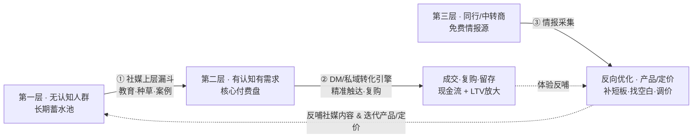

# 用户三层分层 × 双渠道增长闭环 —— 定型报告 + 落地执行手册

> 适用业务：AI 工具 / 虚拟产品，海外平台 + Telegram 私域
> 核心结论：模型逻辑自洽、理论无漏洞；最大变量不是策略好不好，是立刻落地跑通第一个闭环。

---

## 一、模型定型：三层用户 + 双渠道，逻辑自洽

### 1.1 三层用户定义（定型版）

| 层级 | 特征 | 当前价值 | 对应手段 | 核心使命 |
|---|---|---|---|---|
| **第一层 · 无认知人群** | 不知道领域/工具能解决什么问题，无采购需求 | 当前无转化，长期增量蓄水池 | 社媒（短视频/图文/社群） | 教育、种草、案例展示，把第一层持续推向第二层 |
| **第二层 · 有认知有需求** | 知道产品存在、清楚能提效，但信息不对称（不熟悉货源/底价/交付流程） | 当下核心现金流、复购主力 | DM 私信、私域深度触达 | 精准直击，缩短决策链路，催化首单+长期复购 |
| **第三层 · 同行/中转商/竞品卖家** | 询价、体验产品，目的是摸清定价/交付/优缺点 | 几乎不靠其产生主利润，是免费情报源 | 正常对接 + 情报收集 | 把每次咨询当竞品调研窗口，反向优化产品与定价 |

### 1.2 双渠道分工（铁律，不能颠倒）

- **社媒 = 上游漏斗（广度）**：负责「第一层 → 第二层」。教育、制造需求、降低认知门槛。不能硬推销。
- **DM / 私域 = 转化引擎（深度）**：负责「第二层 → 成交复购」。精准直击有认知基础的人，缩短决策链路。

### 1.3 逻辑闭环

社媒持续把小白推成有认知者 → 私域承接并转化 → 复购放大 LTV → 第三层咨询暴露竞争短板 → 反哺社媒内容与产品定价 → 内容更强、获客更准。

断任何一环都会塌：
- 只做内容不承接 = 流量漏在半空；
- 只 DM 不输血 = 竭泽而渔；
- 不要第三层情报 = 瞎子迭代。

### 1.4 闭环图（Mermaid）

---

## 二、补三处漏洞（已定型进体系）

1. **引流载体不二选一**：社媒做广度获陌生流量，DM/私域做深度完成转化。二者是上下游关系。不存在"只私信放弃内容"或"只内容不私域"能长期跑通的生意。
2. **真假客户判断标准**：真实客户聚焦自身使用场景（效率/交付时效/售后）；竞品中间商反复深挖底价、拿货门槛、全套流程，极少聊自身实际使用，不断横向比价。→ 客户正常报价，竞品保留核心底价。
3. **DM 风控红线**：必须依托"社媒接触过"的第二层人群；无差别陌生群发 = 平台风控直接封号。先内容种草，再私信触达，是安全且高效的唯一顺序。

---

## 三、社媒上层漏斗打法（第一层 → 第二层）

### 3.1 平台分工（调研实证）

- **X / Twitter**：AI 人群浓度最高。打法 = 长文个人叙事 + 赠品帖换线索 + 教育型 Thread（收藏转发被算法奖励）。案例：Pieter Levels 靠 X 从 0 到 $132K MRR、几乎 0 广告；Ole Lehmann 65 天 10 万粉卖 $179 课月入 $17.7 万。Bio 转化率优化后可达 **12%**（基准 5%）。
- **TikTok / Shorts**：案例展示主战场。"展示 AI 能做什么" > "讲 AI 是什么"。TikTok 外部链接 CTR **4.8-6.2%**（近 FB 2 倍）。案例：StudyFetch 靠短视频做到 **700 万用户**，新工具发布 48h 内教程流量是一周后的 5-10 倍。
- **小红书**：零粉新号友好，推荐看内容不看粉丝量。封面点击率优秀 8%+、爆款 15-25%；搜索流量转化是推荐 2-3 倍。案例：Flowith 一条笔记 50 万浏览、沉淀 10 个 500 人群。
- **Reddit**：硬广秒被踩。黄金法则 participate 90% / promote 10%，慢热但信任极强、利于 SEO 外链。

### 3.2 可直接抄的内容框架

- **钩子（前 3 秒定生死）**：反常识（"每天发帖正在杀死你的流量"）、禁忌知识、具体数字悬念、错误警告、结果前置。大脑 1.5 秒做留走决定。
- **案例展示模板**：`[Before 真实困境] → [AI 介入，一句人话讲清干了啥] → [After 量化结果] → [情绪落点 + 软 CTA]`。案例吸引"建造者"（离转化更近）。
- **干货降门槛**：3 步法、Before/After 截图、免费资源钩子（模板/清单换关注或 DM）。

### 3.3 内容结构

短视频 Hook 3秒 → 背景 15秒 → 核心 60-120秒 → 观点 30秒 → CTA 5秒；每 5-7 秒一个 micro-hook；目标完播 TikTok 70%+、Shorts 60%+。**CTA 必须"给足价值之后 + 单一动作 + 单一链接"**，否则冷流量转化直接腰斩。

### 3.4 指标基准（知道自己在哪）

| 指标 | 基准区间 | 诊断含义 |
|---|---|---|
| TikTok 观看 → 主页 | 1-3%（爆款 3-5%） | 低 = 钩子/CTA 问题 |
| 主页 → bio 点击 | 3-15% | — |
| 网站访客 → 转化 | 1-3% | 低 = 落地页没承接承诺 |
| 小红书封面点击率 | 合格 3-5% / 优秀 8%+ | — |
| X 访客 → 关注 | 5% → 12%（优化后） | Bio 是转化开关 |

### 3.5 踩坑

- 硬广被限流（价值前置 90%）
- 内容自嗨无转化（没 CTA / 落地页不符承诺）
- 无钩子无承接（必须设计免费模板/清单/社群做沉淀）
- 合规翻车（联盟关系必须文首明示，FTC 违者每项最高 $51,744）

---

## 四、DM / 私域转化引擎（第二层 → 成交复购）

### 4.1 为什么 Telegram 是最佳私域载体

无算法限流（内容直达收件箱）、0 平台抽成、内置支付、互动率 18% vs 社媒 4-6%、触达率 **40-80%**（社媒 organic 仅 2-6%）——这是整个模型成立的**结构性套利地基**。

### 4.2 四种已验证承接形态

- **付费频道/群组（订阅制）**：案例 Marco 健身频道 8 个月 $5,200 MRR / 433 付费 / 87% 月留存，免费试用转化 39%（行业 3 倍）。
- **Bot 自动发货（一次性数字品）**：19 岁开发者 26 个数字产品，Telegram Stars 支付、即时 PDF 交付，客单 $0.5-7、月成本 $0。结论：ship fast、低价、冲动购买、捆绑转化更好。
- **付费群 + 交互 Bot**（个性化功能营收最终超过群本身）——你"底价/货源"差异化的抓手。
- **发单/团购**：@ShopBot 拼团单场 GMV 破 5 万美元。

### 4.3 DM 话术四段式（首条绝不带 pitch）

> 上下文（"你那条关于 X 的评论说到点子上了"）+ 问题（"你目前是不是也卡在 Y"）+ 价值（"我刚整理了份 Z，发你？"）+ 不邀约不报价。

业务版示例：
> "看你之前在问某 AI 工具怎么用。这类工具水挺深——同样产出，货源底价能差 3-5 倍。我刚整理了一张底价对照表，要参考下吗？纯分享，不卖东西。"

### 4.4 转化逻辑（数据支撑）

- 暖 DM 回复率 22-34%，冷 DM 仅 3-5%；先互动 2-3 次再 DM 回复率 30-45%。
- 漏斗：engagement 3-10% → 提取 ICP 30% → DM 回复 15-30% → 成交 20-40%。
- 倒推：要 10 单、回复→成交 25% → 需 40 回复 → 需 200 条 DM → 需约 670 条月互动。

### 4.5 顺序铁律 + 风控养号表（生死线）

| 阶段 | 动作 | 私信上限 |
|---|---|---|
| 第 1-3 天 | 完善资料、加 2-3 群、只看不聊 | 0 |
| 第 4-7 天 | 每日 5-10 条 DM，随机间隔，禁模板 | 5-10 |
| 第 8-14 天 | 10-15 条/日，A/B 开场 | 10-15 |
| 第 15 天+ | 零垃圾标记才加量，轮换账号与代理 | 新号 ≤20-30/日 |

**红线**：注册即大量加群/私信、消息模板完全一致、连续发外链、首条甩链接、对未互动陌生人直接推销——任一即风控。**仿真节奏 > 数量速度**：1 账号:1 代理固定设备，每周设 1-2 天低频日，尊重 opt-out。

### 4.6 复购留存（利润真相）

- 行业付费社群 30 天留存仅 40-50%，做到 85-92% 即健康；参与者留存比潜水者高 31%，周打卡成员 94% vs 71%。
- 周历模板：周一主交付 / 周三案例 / 周四 Q&A 亲自回 / 周日周打卡。
- 续费序列：到期前 30 天总结 ROI、前 7 天列人脉+即将上线+专属礼包（案例续费率 60%→94%）。
- 定价甜蜜点 **$12/月**（转化 8-10%、流失 8-12%）。

---

## 五、竞品情报收集（第三层 → 反向优化）

### 5.1 五类核心记录字段

| 字段 | 记录什么 | 目的 |
|---|---|---|
| 底价关注点 | 反复追问的最低价/阶梯价（记量级，不记精确数字） | 判断对手主力价格带 |
| 拿货门槛 | MOQ / 代理 / 白标 / 代发 | 识别中转商/竞品特征 |
| 流程细节 | 交付物 / 周期 / 验收 / 售后 | 判断对方想"复制"还是"使用" |
| 横向比价 | 提了哪些竞品、要对照表 | 绘制竞争格局 |
| 出现频率 | 同一问题/竞品被问趋势 | 区分噪声与真实信号 |

### 5.2 真假客户 Checklist（打钩计分）

| 维度 | 真实客户（✓ 越多越真） | 竞品中间商（✓ 越多越假） |
|---|---|---|
| 自身场景 | 有具体用例/痛点/触发事件 | 从不谈自己要用 |
| 关注点 | 效率/售后/交付时效/稳定性 | 只问底价/门槛/全套流程 |
| 比价 | 偶发提及竞品 | 系统要求横向对照表 |
| 信息交换 | 愿透露公司/角色/来源 | 回避身份/反问时沉默 |
| 决策 | 有流程/需拉人/有预算方向 | 直接要"最低代理价" |
| 复制意图 | 不追问可复制的底层细节 | 深挖提示词/源码/工作流 |
| 频率 | 单次、目标明确 | 多人多身份问同一底价 |

判定：真实维度 ≥4 且竞品维度 ≤1 → 正常服务；竞品维度 ≥3 → 标记情报窗口；中间态入观察池。

### 5.3 反向优化 SOP

对手反复挖的点 = 市场最在意、你相对弱的环节 → 补强；用量级提问 triangulation 出对手价格带，画价格阶梯表（季度更新）；高频问题 → FAQ / battle card；情报进竞争监控。纪律：**只把竞品价当区间参考，不锚定目标价**；样本量 ≥20-30 条/季才有意义。

### 5.4 底价保护边界

对客户正常透明报价；对疑似竞品只给公开信息，保留真实底价/成本/利润率、未来调价、提示词/工作流/源码等可复制资产。遇索要底层资产自然转移："签约后体现在交付物里"。法律底线：绝不向对手透露未来定价/成本/利润率（一次闲聊也可能构成违法信息交换）。

---

## 六、闭环案例与 KPI（验证可行性）

### 6.1 成功案例（节选）

- **The Rundown AI**：免费每日通讯 1.4M 订阅 → 导入付费教育 $84/月+认证课，年化 $10M，付费占 ~50%。多步分层问卷做个性化落地。
- **白标 AI 转售**：自由职业者 $40/月套餐（成本 $10），3 个月 30 客户 / $4K 月 recurring，流失≈0。另一代理冷启动 1,200 DM → 5 客户 × $1,000 = $5K MRR。
- **TG 自动化漏斗**：关注→礼包 60-80%、培育后成交 +40%、追加销售 +25%，案例月入 $21K。
- **VivaHome TG 私域**：6 个月 12,000 成员、月活 7,800、单场闪购 GMV $23,000。

### 6.2 各层 KPI 基准

| 层 | 指标 | 基准 | 优秀线 |
|---|---|---|---|
| L1 内容 | 粉丝 → 私域转化 | 0.5-2% | 5-20%（高互动赠品） |
| L1 | 落地页访客 → Lead | 20-40% | >40% |
| L2 私域 | TG 触达率 | 40-80% | — |
| L2 | TG 频道 CTR | 10-15% | — |
| L3 成交 | 暖流量成交率 | 3-8% | — |
| L3 | DM 路径回复→演示→成交 | 10%→30%→15% | — |
| L4 复购 | 复购频次 | 1.2→2.3 次/月（案例） | — |
| L4 | LTV:CAC | 目标 3× | — |
| 风控 | 拒付率 | <0.5% 安全 | 1% 即冻结 |

### 6.3 工具栈

- 内容排程：TeleFeed / ControllerBot / Manybot
- TG 管理：Combot / TGStat / InviteMember
- 支付：**Stripe（如实填业务）+ crypto 备用（NOWPayments / USDT）**
- 自动化：python-telegram-bot / Chatfuel

### 6.4 三大死法

1. 只做内容不承接
2. 只 DM 不输血
3. **风控翻车**（Stripe 拒付 >1% 冻结、资金押 90-180 天、MATCH 黑名单）。解法：开 Radar+3DS2、订阅前 7 天邮件提醒、争议率 0.5% 即干预、**永远保留备用通道**、月流水 $50K+ 转专用 high-risk gateway。

---

## 七、30 天落地执行 SOP（整合版）

- **第 1 周**：注册 TG 号养号（完善资料、加 3 个 AI 群、只看不聊）；同时开社媒账号发纯价值干货（≥80% 价值、≤20% 提产品）。锁定一个**细到能痛的切口**（"__人群_用 AI 解决__具体痛点__"，别做 AI 大全）。
- **第 2 周**：建免费公开频道 + 私有付费频道（InviteMember）；做 1 份具体 Lead Magnet（清单/模板，不是"AI 成功指南"空话）放 Bio 引流。
- **第 3 周**：在目标人群内容下**真实互动 2-3 次/人**；用四段式话术发首批价值型 DM（新号 ≤10 条/日、分散全天）。
- **第 4 周**：互动者引到免费频道 → 免费试用/限时价转首单；搭 Bot 自动发货数字品（$9-49 首单）。
- **持续**：周历内容节奏 + 周四 Q&A + 周打卡；续费提醒序列；每月测一次价格/内容；用 TGStat 收集竞品与高频问题反哺内容。

**MVP 验证门槛**：2-4 周内用近似零成本验证"100 个私域用户能否出 3-5 单"（对应 3-5% 暖转化基准）。通 → 加大公域频率+跨平台；不通 → 多半卡在痛点不痛/信任不足/结账摩擦，先修漏斗再买量。

---

## 八、浓缩核心公式

> **社媒培育认知（一层升二层）+ 私域 DM 催化成交（二层变现）+ 竞品咨询情报收集（持续优化）= 完整增长闭环**

模型逻辑自洽、理论无漏洞，最大变量不是策略好不好，是立刻落地跑通第一个闭环。现在只差 make it first。
